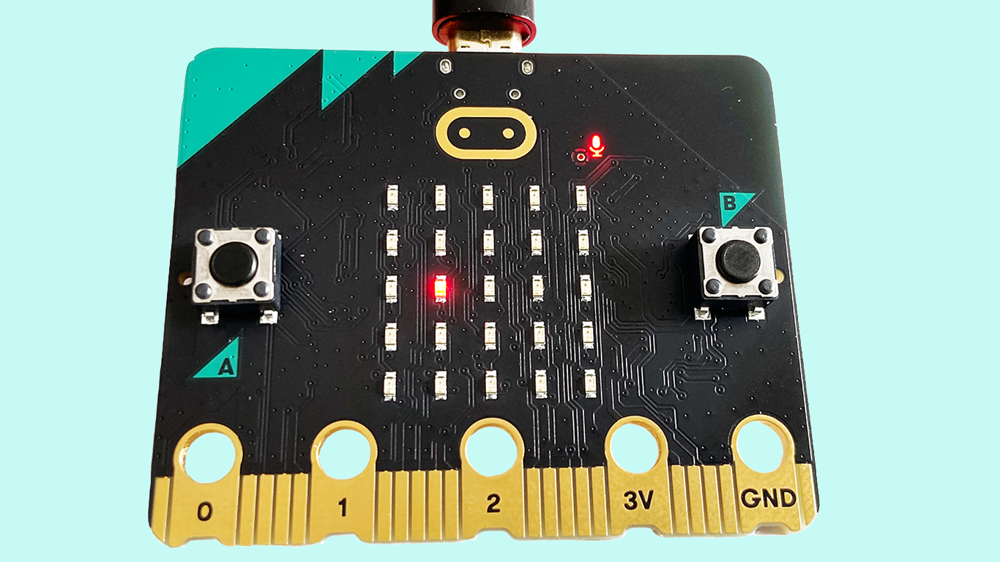

Maker Media GmbH

***

# Den-BBC-Micro-bit-in-Python-programmieren

**Der BBC Micro:bit bietet zahlreiche Funktionen für den Einstieg in die Mikrocontroller-Welt: Sensoren für Bewegung oder Lautstärke, Taster, 25 LEDs zur Anzeige, Soundgenerator, Steuer-Ein-/-Ausgänge und vieles mehr. Um sich damit auseinanderzusetzen, ist ein Spiel ein motivierender Einstieg. Wer eine Echtzeitanwendung wie ein Spiel in MicroPython erstellen kann, kann Programme mit Steueraufgaben verfassen, bei denen das richtige Timing eine wesentliche Rolle spielt.**

Der vollständige Artikel zum Projekt erscheint in der Make 4/24.
